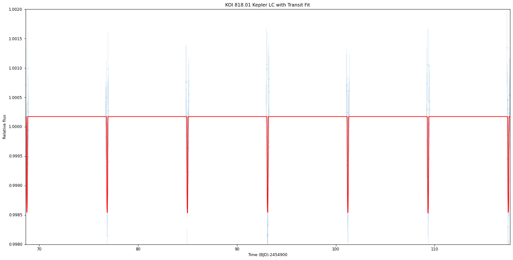
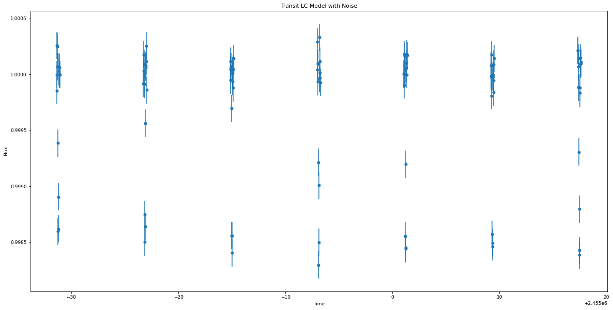
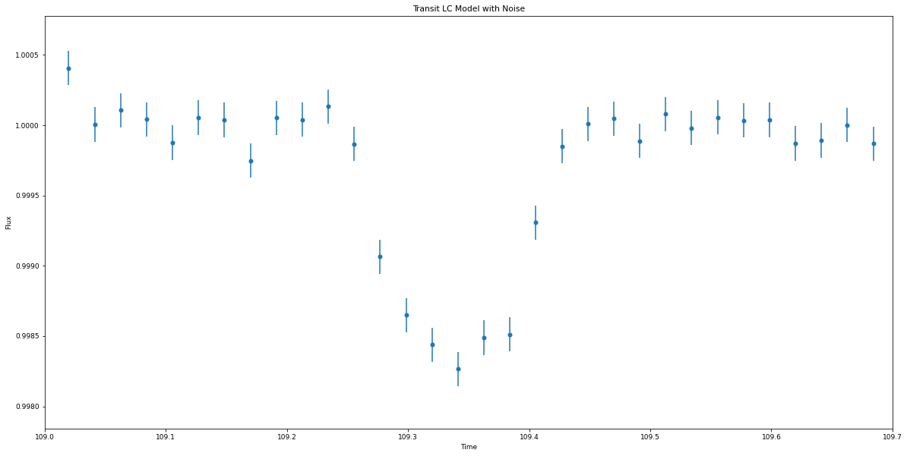
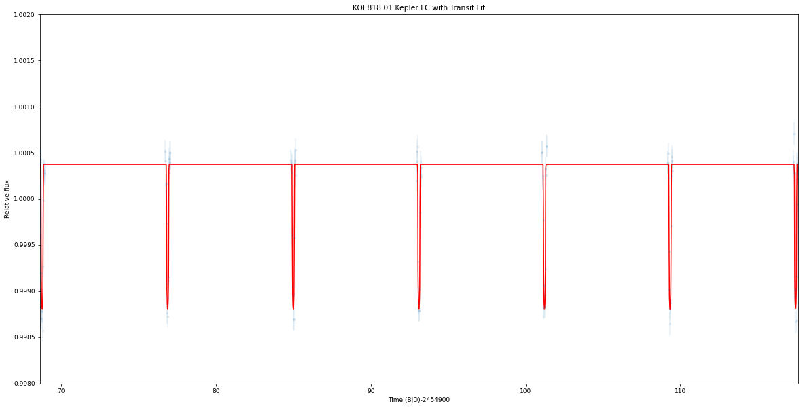

``photoeccentric`` Tutorial
===========================

In this tutorial, I will create a simulated transit based on a Kepler
planet and demonstrate how to use ``photoeccentric`` to recover the
planet’s eccentricity using the photoeccentric effect `(Dawson & Johnson
2012) <https://arxiv.org/pdf/1203.5537.pdf>`__.

The code I’m using to implement the photoeccentric effect is compiled
into a package called ``photoeccentric``, and can be viewed/downloaded
here: https://github.com/ssagear/photoeccentric

.. code:: ipython3

    import numpy as np
    import matplotlib.pyplot as plt
    import pandas as pd
    from tqdm import tqdm
    from astropy.table import Table
    import astropy.units as u
    import os
    import pickle
    import scipy
    import random
    
    # Using `batman` to create & fit fake transit
    import batman
    
    # Using astropy BLS and scipy curve_fit to fit transit
    from astropy.timeseries import BoxLeastSquares
    
    # Using juliet & corner to find and plot (e, w) distribution
    import juliet
    import corner
    
    # Using dynesty to do the same with nested sampling
    import dynesty
    
    # And importing `photoeccentric`
    import photoeccentric as ph
    
    %load_ext autoreload
    %autoreload 2
    
    # pandas display option
    pd.set_option('display.float_format', lambda x: '%.5f' % x)
    
    spectplanets = pd.read_csv('/Users/ssagear/Dropbox (UFL)/Research/MetallicityProject/HiPerGator/HPG_Replica/datafiles/spectplanets.csv')
    muirhead_comb = pd.read_csv('/Users/ssagear/Dropbox (UFL)/Research/MetallicityProject/HiPerGator/HPG_Replica/datafiles/muirhead_comb.csv')
    muirheadKOIs = pd.read_csv('/Users/ssagear/Dropbox (UFL)/Research/MetallicityProject/HiPerGator/HPG_Replica/datafiles/MuirheadKOIs.csv')
    lcpath = '/Users/ssagear/Dropbox (UFL)/Research/MetallicityProject/HiPerGator/HPG_Replica/sample_lcs'
    
    plt.rcParams['figure.figsize'] = [20, 10]
    
    %load_ext autoreload
    %autoreload 2

.. parsed-literal::

    The autoreload extension is already loaded. To reload it, use:
      %reload_ext autoreload

I’ll define the conversions between solar mass -> kg and solar radius ->
meters for convenience.

.. code:: ipython3

    smass_kg = 1.9885e30  # Solar mass (kg)
    srad_m = 696.34e6 # Solar radius (m)

The Sample
----------

I’m using the sample of “cool KOIs” from `Muirhead et
al. 2013 <https://iopscience.iop.org/article/10.1088/0067-0049/213/1/5>`__,
and their properites from spectroscopy published here.

I’m reading in several .csv files containing data for this sample. The
data includes spectroscopy data from Muirhead et al. (2013), stellar and
planet parameters from the Kepler archive, and distances/luminosities
from Gaia.

.. code:: ipython3

    muirhead_data = pd.read_csv("datafiles/muirhead_data_incmissing.txt", sep=" ")
    
    # ALL Kepler planets from exo archive
    planets = pd.read_csv('datafiles/cumulative_kois.csv')
    
    # Take the Kepler planet archive entries for the planets in Muirhead et al. 2013 sample
    spectplanets = pd.read_csv('datafiles/spectplanets.csv')
    
    # Kepler-Gaia Data
    kpgaia = Table.read('datafiles/kepler_dr2_4arcsec.fits', format='fits').to_pandas();
    
    # Kepler-Gaia data for only the objects in our sample
    muirhead_gaia = pd.read_csv("datafiles/muirhead_gaia.csv")
    
    # Combined spectroscopy data + Gaia/Kepler data for our sample
    muirhead_comb = pd.read_csv('datafiles/muirhead_comb.csv')
    
    # Only targets from table above with published luminosities from Gaia
    muirhead_comb_lums = pd.read_csv('datafiles/muirhead_comb_lums.csv')

Defining a “test planet”
========================

I’m going to pick a planet from our sample to test how well ``photoeccentric`` works. Here, I’m picking KOI 818.01 (Kepler-691 b), a super-Earth orbiting an M dwarf.
~~~~~~~~~~~~~~~~~~~~~~~~~~~~~~~~~~~~~~~~~~~~~~~~~~~~~~~~~~~~~~~~~~~~~~~~~~~~~~~~~~~~~~~~~~~~~~~~~~~~~~~~~~~~~~~~~~~~~~~~~~~~~~~~~~~~~~~~~~~~~~~~~~~~~~~~~~~~~~~~~~~~~

`Exoplanet Catalog
Entry <https://exoplanets.nasa.gov/exoplanet-catalog/4987/kepler-818-b/>`__

It has an orbital period of about 8 days.

First, I’ll use the spectroscopy data from Muirhead et al. 2013 and Gaia
luminosities to constrain the mass and radius of the host star beyond
the constraint published in the Exoplanet Archive. I’ll do this by
matching these data with stellar isochrones
`MESA <https://iopscience.iop.org/article/10.3847/0004-637X/823/2/102>`__
and using the masses/radii from the matching isochrones to constrian the
stellar density.

.. code:: ipython3

    nkoi = 818.01

I’ll read in a file with the MESA stellar isochrones for low-mass stars.
I’ll use ``ph.fit_isochrone_lum()`` to find the subset of stellar
isochrones that are consistent with a certain stellar parameters form
Kepler-691 (Teff, Mstar, Rstar, and Gaia luminosity).

.. code:: ipython3

    # # Read in MESA isochrones
    isochrones = pd.read_csv('datafiles/isochrones_sdss_spitzer_lowmass.dat', sep='\s\s+', engine='python')

Using ``ph.fit_isochrone_lum()`` to match isochrones to stellar data:

.. code:: ipython3

    koi818 = muirhead_comb.loc[muirhead_comb['KOI'] == '818']

.. code:: ipython3

    iso_lums = ph.fit_isochrone_lum(koi818, isochrones)

.. parsed-literal::

    100%|██████████| 738479/738479 [00:06<00:00, 116182.48it/s]

.. parsed-literal::

    Number of fit isochrones:  84

.. parsed-literal::

    

.. code:: ipython3

    # Write to csv, then read back in (prevents notebook from lagging)
    iso_lums.to_csv("tutorial01/iso_lums_" + str(nkoi) + ".csv")

.. code:: ipython3

    isodf = pd.read_csv("tutorial01/iso_lums_" + str(nkoi) + ".csv")

Define a KeplerStar object, and use ph.get_stellar_params and the fit
isochrones to get the stellar parameters.

.. code:: ipython3

    SKOI = int(np.floor(float(nkoi)))
    print('System KOI', SKOI)
    
    star = ph.KeplerStar(SKOI)
    star.get_stellar_params(isodf)

.. parsed-literal::

    System KOI 818

.. code:: ipython3

    print('Stellar Mass (Msol): ', star.mstar)
    print('Stellar Radius (Rsol): ', star.rstar)
    print('Average Stellar Density (kg m^-3): ', star.rho_star)

.. parsed-literal::

    Stellar Mass (Msol):  0.5691952380952375
    Stellar Radius (Rsol):  0.5488321428571431
    Average Stellar Density (kg m^-3):  4850.87609359922

Define a KOI object.

.. code:: ipython3

    koi = ph.KOI(nkoi, SKOI, isodf)
    koi.get_KIC(muirhead_comb)
    
    print('KIC', koi.KIC)

.. parsed-literal::

    KIC 4913852

Creating a fake light curve based on a real planet
==================================================

I’m pulling the planet parameters of Kepler-691 b from the exoplanet
archive using ``ph.planet_params_from_archive()``. This will give me the
published period, Rp/Rs, and inclination constraints of this planet.

I’m calculating a/Rs using ``ph.calc_a()``, instead of using the a/Rs
constraint from the Exoplanet Archive. The reason is because a/Rs must
be consistent with the density calculated above from spectroscopy/Gaia
for the photoeccentric effect to work correctly, and the published a/Rs
is often inconsistent. a/Rs depends on the orbital period, Mstar, and
Rstar.

Let’s force the inclination to be 90 degrees for this example.

.. code:: ipython3

    koi.planet_params_from_archive(spectplanets)
    koi.calc_a(koi.mstar, koi.rstar)
    
    print('Stellar mass (Msun): ', koi.mstar, 'Stellar radius (Rsun): ', koi.rstar)
    print('Period (Days): ', koi.period, 'Rp/Rs: ', koi.rprs)
    print('a/Rs: ', koi.a_rs)
    
    koi.i = 90.
    print('i (deg): ', koi.i)

.. parsed-literal::

    Stellar mass (Msun):  0.5691952380952375 Stellar radius (Rsun):  0.5488321428571431
    Period (Days):  8.11437482 Rp/Rs:  0.037204
    a/Rs:  25.63672846518325
    i (deg):  90.0

Now, I’ll create a fake transit using ``batman``. I’m creating a model
with the period, Rp/Rs, a/Rs, and inclination specified by the Kepler
catalog entry and the density constraints.

I’ll create the transit model with an :math:`e` and :math:`w` of my
choice. This will allow me to test whether ``photoeccentric`` accurately
recovers the :math:`(e,w)` combination I have input. I’ll start with
:math:`e = 0.0` and :math:`w = 90.0` degrees.

:math:`e = 0.0`, :math:`\omega = 90.0`
--------------------------------------

I define a cadence length (~30 minutes, in days) that matches the Kepler
long-cadence integration time, so I can create a fake light curve that
integrates over the same time as real Kepler light curves.

I want to replicate the real Kepler light curve as closely as possible.
So I am taking these parameters fromm the light curves

.. code:: ipython3

    # Define the working directory
    direct = 'tutorial01/' + str(nkoi) + '/e_0.0_w_90.0/'

First, reading in the light curves that I have saved for this planet.

.. code:: ipython3

    KICs = np.sort(np.unique(np.array(muirhead_comb['KIC'])))
    KOIs = np.sort(np.unique(np.array(muirhead_comb['KOI'])))
    
    files = ph.get_lc_files(koi.KIC, KICs, lcpath)

.. code:: ipython3

    # Stitching the light curves together, preserving the time stamps
    koi.get_stitched_lcs(files)
    
    # Getting the midpoint times
    koi.get_midpoints()

.. code:: ipython3

    starttime = koi.time[0]
    endtime = koi.time[-1]

.. code:: ipython3

    # 30 minute cadence
    cadence = 0.02142857142857143
    
    time = np.arange(starttime, endtime, cadence)

.. code:: ipython3

    # Define e and w, calculate flux from transit model
    e = 0.0
    w = 90.0
    
    params = batman.TransitParams()       #object to store transit parameters
    params.t0 = koi.epoch                 #time of inferior conjunction
    params.per = koi.period               #orbital period
    params.rp = koi.rprs                  #planet radius (in units of stellar radii)
    params.a = koi.a_rs                   #semi-major axis (in units of stellar radii)
    params.inc = koi.i                    #orbital inclination (in degrees)
    params.ecc = e                        #eccentricity
    params.w = w                          #longitude of periastron (in degrees)
    params.limb_dark = "nonlinear"        #limb darkening model
    params.u = [0.5, 0.1, 0.1, -0.1]      #limb darkening coefficients [u1, u2, u3, u4]
    
    t = time
    m = batman.TransitModel(params, t, supersample_factor = 29, exp_time = 0.0201389)

.. code:: ipython3

    flux = m.light_curve(params)

.. code:: ipython3

    time = time
    flux = flux
    
    plt.plot(time-2454900, flux)
    plt.xlim(109,109.7)
    plt.xlabel('Time (BJD-2454900)')
    plt.ylabel('Normalized Flux')
    plt.title('Transit LC Model')

.. parsed-literal::

    Text(0.5, 1.0, 'Transit LC Model')

To create a light curve with a target signal to noise ratio, we need the
transit duration, number of transits, and the number of points in each
transit, and the transit depth.

.. code:: ipython3

    tduration = koi.dur/24.0
    
    N = round(ph.get_N_intransit(tduration, cadence))
    ntransits = len(koi.midpoints)
    depth = koi.rprs**2

The magnitude of each individual error bar:

.. code:: ipython3

    errbar = ph.get_sigma_individual(60, N, ntransits, depth)

Adding gaussian noise to produce a light curve with the target SNR:

(NB: the noise is gaussian and uncorrelated, unlike the noise in real
Kepler light curves)

.. code:: ipython3

    noise = np.random.normal(0,errbar,len(time))
    nflux = flux+noise
    
    flux_err = np.array([errbar]*len(nflux))

.. code:: ipython3

    plt.errorbar(time-2454900, nflux, yerr=flux_err, fmt='o')
    plt.xlabel('Time')
    plt.ylabel('Flux')
    plt.xlim(109,109.7)
    plt.title('Transit LC Model with Noise')

.. parsed-literal::

    Text(0.5, 1.0, 'Transit LC Model with Noise')

Fitting the transit
-------------------

``photoeccentric`` includes functionality to fit using ``juliet`` with
``multinest``.

First, I’ll fit the transit shape with ``juliet``. :math:`Rp/Rs`,
:math:`a/Rs`, :math:`i`, and :math:`w` are allowed to vary as free
parameters.

The transit fitter, ``ph.planetlc_fitter``, fixes :math:`e = 0.0`, even
if the input eccentricity is not zero! This means that if e is not 0,
the transit fitter will fit the “wrong” values for :math:`a/Rs` and
:math:`i` – but they will be wrong in such a way that reveals the
eccentricity of the orbit. More on that in the next section.

I enter an initial guess based on what I estimate the fit parameters
will be. For this one, I’ll enter values close to the Kepler archive
parameters.

Removing Out of Transit Data
''''''''''''''''''''''''''''

.. code:: ipython3

    koi.time = time
    koi.flux = nflux
    koi.flux_err = flux_err

Let’s just do the first 7 transits.

.. code:: ipython3

    koi.midpoints = koi.midpoints[0:7]

.. code:: ipython3

    koi.remove_oot_data(7, 6)

.. code:: ipython3

    plt.errorbar(koi.time_intransit, koi.flux_intransit, yerr=koi.fluxerr_intransit, fmt='o')
    plt.xlabel('Time')
    plt.ylabel('Flux')
    plt.title('Transit LC Model with Noise')

.. parsed-literal::

    Text(0.5, 1.0, 'Transit LC Model with Noise')

.. image:: output_56_1.png

.. code:: ipython3

    nlive=1000
    nsupersample=29
    exptimesupersample=0.0201389

.. code:: ipython3

    dataset, results = koi.do_tfit_juliet(direct, nsupersample=nsupersample, exptimesupersample=exptimesupersample, nlive=nlive)

.. parsed-literal::

    Fitting KOI 818.01
    Detected multinest sampler output files --- extracting from tutorial01/818.01/e_0.0_w_90.0/posteriors.pkl

.. code:: ipython3

    res = pd.read_table(direct + 'posteriors.dat')

.. code:: ipython3

    # Print transit fit results from Juliet
    res

.. raw:: html

    

    
    <table border="1" class="dataframe">
      <thead>
        <tr style="text-align: right;">
          <th></th>
          <th># Parameter Name</th>
          <th></th>
          <th>Median</th>
          <th>.1</th>
          <th>Upper 68 CI</th>
          <th>.2</th>
          <th>Lower 68 CI</th>
        </tr>
      </thead>
      <tbody>
        <tr>
          <th>0</th>
          <td>P_p1</td>
          <td></td>
          <td>8.11226</td>
          <td></td>
          <td>0.00124</td>
          <td></td>
          <td>0.00126</td>
        </tr>
        <tr>
          <th>1</th>
          <td>t0_p1</td>
          <td></td>
          <td>2455009.34088</td>
          <td></td>
          <td>0.00372</td>
          <td></td>
          <td>0.00398</td>
        </tr>
        <tr>
          <th>2</th>
          <td>p_p1</td>
          <td></td>
          <td>0.03832</td>
          <td></td>
          <td>0.00229</td>
          <td></td>
          <td>0.00229</td>
        </tr>
        <tr>
          <th>3</th>
          <td>b_p1</td>
          <td></td>
          <td>0.33712</td>
          <td></td>
          <td>0.25833</td>
          <td></td>
          <td>0.22439</td>
        </tr>
        <tr>
          <th>4</th>
          <td>q1_KEPLER</td>
          <td></td>
          <td>0.50266</td>
          <td></td>
          <td>0.32074</td>
          <td></td>
          <td>0.30654</td>
        </tr>
        <tr>
          <th>5</th>
          <td>q2_KEPLER</td>
          <td></td>
          <td>0.46850</td>
          <td></td>
          <td>0.33069</td>
          <td></td>
          <td>0.31063</td>
        </tr>
        <tr>
          <th>6</th>
          <td>a_p1</td>
          <td></td>
          <td>22.22587</td>
          <td></td>
          <td>2.74053</td>
          <td></td>
          <td>3.13032</td>
        </tr>
        <tr>
          <th>7</th>
          <td>mflux_KEPLER</td>
          <td></td>
          <td>-0.00019</td>
          <td></td>
          <td>0.00008</td>
          <td></td>
          <td>0.00008</td>
        </tr>
        <tr>
          <th>8</th>
          <td>sigma_w_KEPLER</td>
          <td></td>
          <td>3.92579</td>
          <td></td>
          <td>52.73840</td>
          <td></td>
          <td>3.59434</td>
        </tr>
      </tbody>
    </table>
    

.. code:: ipython3

    # Save fit planet parameters to variables for convenience
    per_f = res.iloc[0][2]
    t0_f = res.iloc[1][2]
    rprs_f = res.iloc[2][2]
    b_f = res.iloc[3][2]
    a_f = res.iloc[6][2]
    
    i_f = np.arccos(b_f*(1./a_f))*(180./np.pi)

Below, I plot the transit fit corner plot.

Because I input :math:`e = 0.0`, the transit fitter should return close
to the same parameters I input (because the transit fitter always
requires :math:`e = 0.0`).

.. code:: ipython3

    # Plot the transit fit corner plot
    p = results.posteriors['posterior_samples']['P_p1']
    t0 = results.posteriors['posterior_samples']['t0_p1']
    rprs = results.posteriors['posterior_samples']['p_p1']
    b = results.posteriors['posterior_samples']['b_p1']
    a = results.posteriors['posterior_samples']['a_p1']
    inc = np.arccos(b*(1./a))*(180./np.pi)
    
    params = ['Period', 't0', 'rprs', 'inc', 'a']
    
    fs = np.vstack((p, t0, rprs, inc, a))
    fs = fs.T
    
    figure = corner.corner(fs, labels=params)

.. code:: ipython3

    # Plot the data:
    plt.errorbar(dataset.times_lc['KEPLER']-2454900, dataset.data_lc['KEPLER'], \
                 yerr = dataset.errors_lc['KEPLER'], fmt = '.', alpha = 0.1)
    
    # Plot the model:
    plt.plot(dataset.times_lc['KEPLER']-2454900, results.lc.evaluate('KEPLER'), c='r')
    
    plt.xlabel('Time (BJD)-2454900')
    plt.xlim(np.min(dataset.times_lc['KEPLER'])-2454900, np.max(dataset.times_lc['KEPLER'])-2454900)
    plt.ylim(0.998, 1.002)
    plt.ylabel('Relative flux')
    plt.title('KOI 818.01 Kepler LC with Transit Fit')
    plt.show()

.. image:: output_64_0.png

Determining T14 and T23
~~~~~~~~~~~~~~~~~~~~~~~

A crucial step to determining the :math:`(e, w)` distribution from the
transit is calculating the total and full transit durations. T14 is the
total transit duration (the time between first and fourth contact). T23
is the full transit duration (i.e. the time during which the entire
planet disk is in front of the star, the time between second and third
contact.)

Here, I’m using equations 14 and 15 from `this
textbook <https://sites.astro.caltech.edu/~lah/review/transits_occultations.winn.pdf>`__.
We calculate T14 and T23 assuming the orbit must be circular, and using
the fit parameters assuming the orbit is circular. (If the orbit is not
circular, T14 and T23 will not be correct – but this is what we want,
because they will differ from the true T14 and T23 in a way that reveals
the eccentricity of the orbit.)

.. code:: ipython3

    koi.calc_durations()

.. code:: ipython3

    print('Total Transit Duration: ', np.mean(koi.T14_dist), '-/+', koi.T14_errs, 'hours')
    print('Full Transit Duration: ', np.mean(koi.T23_dist), '-/+', koi.T23_errs, 'hours')

.. parsed-literal::

    Total Transit Duration:  0.11214203271552389 -/+ (0.009074328077622193, 0.01008020097475372) hours
    Full Transit Duration:  0.10149275417258226 -/+ (0.009142889397238452, 0.009728546427558826) hours

Get :math:`g`
=============

Finally, we can use all the values above to determine
:math:`\rho_{circ}`. :math:`\rho_{circ}` is what we would calculate the
stellar density to be if we knew that the orbit was definitely perfectly
circular. We will compare :math:`\rho_{circ}` to :math:`\rho_{star}`
(the true, observed stellar density we calculated from
spectroscopy/Gaia), and get :math:`g(e, w)`: |image.png|

.. |image.png| image:: attachment:image.png

which is also defined as |image.png|

.. |image.png| image:: attachment:image.png

Thus, if the orbit is circular :math:`(e = 0)`, then :math:`g` should
equal 1. If the orbit is not circular :math:`(e != 0)`, then
:math:`\rho_{circ}` should differ from :math:`\rho_{star}`, and
:math:`g` should be something other than 1. We can draw a :math:`(e, w)`
distribution based on the value we calcaulte for :math:`g(e,w)`!

``ph.get_g_distribution()`` will help us determine the value of g. This
function takes the observed :math:`\rho_{star}` as well as the fit
(circular) transit parameters and calculated transit durations, and
calculates :math:`\rho_{circ}` and :math:`g(e,w)` based on equations 6
and 7 in `Dawson & Johnson
2012 <https://arxiv.org/pdf/1203.5537.pdf>`__.

Print :math:`g` and :math:`\sigma_{g}`:

.. code:: ipython3

    koi.get_gs()

.. code:: ipython3

    g_mean = koi.g_mean
    g_sigma = koi.g_sigma

.. code:: ipython3

    g_mean

.. parsed-literal::

    0.8667875306010682

.. code:: ipython3

    g_sigma

.. parsed-literal::

    0.140700574554469

The mean of :math:`g` is about 1.0, which means that :math:`\rho_{circ}`
agrees with :math:`\rho_{star}` and the eccentricity of this transit
must be zero, which is exactly what we input! We can take :math:`g` and
:math:`\sigma_{g}` and use MCMC (``emcee``) to determine the surface of
most likely :math:`(e,w)`.

``photoeccentric`` has the probability function for :math:`(e,w)` from
:math:`g` built in to ``ph.log_probability()``.

.. code:: ipython3

    koi.do_eccfit(direct)

.. parsed-literal::

    17172it [01:55, 148.53it/s, batch: 15 | bound: 0 | nc: 1 | ncall: 68564 | eff(%): 25.045 | loglstar: -0.191 <  1.961 <  1.710 | logz:  1.256 +/-  0.042 | stop:  0.955]          

.. code:: ipython3

    with open(direct + '/kepewdres.pickle', 'rb') as f:
        ewdres = pickle.load(f)

.. code:: ipython3

    labels = ["w", "e"]
    
    fig = corner.corner(ewdres.samples, labels=labels, title_kwargs={"fontsize": 12}, truths=[w, e], plot_contours=True)

.. image:: output_82_0.png

And here is the corner plot for the most likely values of :math:`(e, w)`
that correspond to :math:`g = 1`. The :math:`e` distribution peaks at 0!

:math:`e = 0.3`, :math:`\omega = 90.0`
--------------------------------------

Now let’s repeat this example with an eccentricity of 0.3 at periapse.

.. code:: ipython3

    # Define the working directory
    direct = 'tutorial01/' + str(nkoi) + '/e_0.3_w_90.0/'

.. code:: ipython3

    # 30 minute cadence
    cadence = 0.02142857142857143
    
    time = np.arange(starttime, endtime, cadence)

.. code:: ipython3

    # Define e and w, calculate flux from transit model
    e = 0.3
    w = 90.0
    
    params = batman.TransitParams()       #object to store transit parameters
    params.t0 = koi.epoch                 #time of inferior conjunction
    params.per = koi.period               #orbital period
    params.rp = koi.rprs                  #planet radius (in units of stellar radii)
    params.a = koi.a_rs                   #semi-major axis (in units of stellar radii)
    params.inc = koi.i                    #orbital inclination (in degrees)
    params.ecc = e                        #eccentricity
    params.w = w                          #longitude of periastron (in degrees)
    params.limb_dark = "nonlinear"        #limb darkening model
    params.u = [0.5, 0.1, 0.1, -0.1]      #limb darkening coefficients [u1, u2, u3, u4]
    
    t = time
    m = batman.TransitModel(params, t, supersample_factor = 29, exp_time = 0.0201389)

.. code:: ipython3

    flux = m.light_curve(params)

.. code:: ipython3

    time = time
    flux = flux
    
    plt.plot(time-2454900, flux)
    plt.xlim(109,109.7)
    plt.xlabel('Time (BJD-2454900)')
    plt.ylabel('Normalized Flux')
    plt.title('Transit LC Model')

.. parsed-literal::

    Text(0.5, 1.0, 'Transit LC Model')

.. image:: output_90_1.png

To create a light curve with a target signal to noise ratio, we need the
transit duration, number of transits, and the number of points in each
transit, and the transit depth.

.. code:: ipython3

    tduration = koi.dur/24.0
    
    N = round(ph.get_N_intransit(tduration, cadence))
    ntransits = len(koi.midpoints)
    depth = koi.rprs**2

The magnitude of each individual error bar:

.. code:: ipython3

    errbar = ph.get_sigma_individual(60, N, ntransits, depth)

Adding gaussian noise to produce a light curve with the target SNR:

.. code:: ipython3

    noise = np.random.normal(0,errbar,len(time))
    nflux = flux+noise
    
    flux_err = np.array([errbar]*len(nflux))

.. code:: ipython3

    plt.errorbar(time-2454900, nflux, yerr=flux_err, fmt='o')
    plt.xlabel('Time')
    plt.ylabel('Flux')
    plt.xlim(109,109.7)
    plt.title('Transit LC Model with Noise')

.. parsed-literal::

    Text(0.5, 1.0, 'Transit LC Model with Noise')

.. image:: output_97_1.png

Fitting the transit
-------------------

``photoeccentric`` includes functionality to fit using ``juliet`` with
``multinest``.

First, I’ll fit the transit shape with ``juliet``. :math:`Rp/Rs`,
:math:`a/Rs`, :math:`i`, and :math:`w` are allowed to vary as free
parameters.

The transit fitter, ``ph.planetlc_fitter``, fixes :math:`e = 0.0`, even
if the input eccentricity is not zero! This means that if e is not 0,
the transit fitter will fit the “wrong” values for :math:`a/Rs` and
:math:`i` – but they will be wrong in such a way that reveals the
eccentricity of the orbit. More on that in the next section.

I enter an initial guess based on what I estimate the fit parameters
will be. For this one, I’ll enter values close to the Kepler archive
parameters.

Removing Out of Transit Data
''''''''''''''''''''''''''''

.. code:: ipython3

    koi.time = time
    koi.flux = nflux
    koi.flux_err = flux_err

Let’s just do the first 7 transits.

.. code:: ipython3

    koi.midpoints = koi.midpoints[0:7]

.. code:: ipython3

    koi.remove_oot_data(7, 6)

.. code:: ipython3

    plt.errorbar(koi.time_intransit, koi.flux_intransit, yerr=koi.fluxerr_intransit, fmt='o')
    plt.xlabel('Time')
    plt.ylabel('Flux')
    plt.title('Transit LC Model with Noise')

.. parsed-literal::

    Text(0.5, 1.0, 'Transit LC Model with Noise')

.. code:: ipython3

    nlive=1000
    nsupersample=29
    exptimesupersample=0.0201389

.. code:: ipython3

    dataset, results = koi.do_tfit_juliet(direct, nsupersample=nsupersample, exptimesupersample=exptimesupersample, nlive=nlive)

.. parsed-literal::

    Fitting KOI 818.01
    Detected multinest sampler output files --- extracting from tutorial01/818.01/e_0.3_w_90.0/posteriors.pkl

.. code:: ipython3

    res = pd.read_table(direct + 'posteriors.dat')

.. code:: ipython3

    # Print transit fit results from Juliet
    res

.. raw:: html

    

    
    <table border="1" class="dataframe">
      <thead>
        <tr style="text-align: right;">
          <th></th>
          <th># Parameter Name</th>
          <th></th>
          <th>Median</th>
          <th>.1</th>
          <th>Upper 68 CI</th>
          <th>.2</th>
          <th>Lower 68 CI</th>
        </tr>
      </thead>
      <tbody>
        <tr>
          <th>0</th>
          <td>P_p1</td>
          <td></td>
          <td>8.11452</td>
          <td></td>
          <td>0.00023</td>
          <td></td>
          <td>0.00021</td>
        </tr>
        <tr>
          <th>1</th>
          <td>t0_p1</td>
          <td></td>
          <td>2455009.33937</td>
          <td></td>
          <td>0.00062</td>
          <td></td>
          <td>0.00063</td>
        </tr>
        <tr>
          <th>2</th>
          <td>p_p1</td>
          <td></td>
          <td>0.03809</td>
          <td></td>
          <td>0.00097</td>
          <td></td>
          <td>0.00105</td>
        </tr>
        <tr>
          <th>3</th>
          <td>b_p1</td>
          <td></td>
          <td>0.34853</td>
          <td></td>
          <td>0.26925</td>
          <td></td>
          <td>0.23012</td>
        </tr>
        <tr>
          <th>4</th>
          <td>q1_KEPLER</td>
          <td></td>
          <td>0.17705</td>
          <td></td>
          <td>0.30725</td>
          <td></td>
          <td>0.12297</td>
        </tr>
        <tr>
          <th>5</th>
          <td>q2_KEPLER</td>
          <td></td>
          <td>0.23627</td>
          <td></td>
          <td>0.34725</td>
          <td></td>
          <td>0.17349</td>
        </tr>
        <tr>
          <th>6</th>
          <td>a_p1</td>
          <td></td>
          <td>33.21021</td>
          <td></td>
          <td>2.06751</td>
          <td></td>
          <td>4.97506</td>
        </tr>
        <tr>
          <th>7</th>
          <td>mflux_KEPLER</td>
          <td></td>
          <td>-0.00005</td>
          <td></td>
          <td>0.00001</td>
          <td></td>
          <td>0.00001</td>
        </tr>
        <tr>
          <th>8</th>
          <td>sigma_w_KEPLER</td>
          <td></td>
          <td>2.76826</td>
          <td></td>
          <td>22.64271</td>
          <td></td>
          <td>2.45362</td>
        </tr>
      </tbody>
    </table>
    

.. code:: ipython3

    # Save fit planet parameters to variables for convenience
    per_f = res.iloc[0][2]
    t0_f = res.iloc[1][2]
    rprs_f = res.iloc[2][2]
    b_f = res.iloc[3][2]
    a_f = res.iloc[6][2]
    
    i_f = np.arccos(b_f*(1./a_f))*(180./np.pi)

Below, I print the original parameters and fit parameters, and overlay
the fit light curve on the input light curve.

Because I input :math:`e = 0.0`, the transit fitter should return the
exact same parameters I input (because the transit fitter always
requires :math:`e = 0.0`).

.. code:: ipython3

    # Plot the transit fit corner plot
    p = results.posteriors['posterior_samples']['P_p1']
    t0 = results.posteriors['posterior_samples']['t0_p1']
    rprs = results.posteriors['posterior_samples']['p_p1']
    b = results.posteriors['posterior_samples']['b_p1']
    a = results.posteriors['posterior_samples']['a_p1']
    inc = np.arccos(b*(1./a))*(180./np.pi)
    
    params = ['Period', 't0', 'rprs', 'inc', 'a']
    
    fs = np.vstack((p, t0, rprs, inc, a))
    fs = fs.T
    
    figure = corner.corner(fs, labels=params)

.. image:: output_113_0.png

.. code:: ipython3

    # Plot the data:
    plt.errorbar(dataset.times_lc['KEPLER']-2454900, dataset.data_lc['KEPLER'], \
                 yerr = dataset.errors_lc['KEPLER'], fmt = '.', alpha = 0.1)
    
    # Plot the model:
    plt.plot(dataset.times_lc['KEPLER']-2454900, results.lc.evaluate('KEPLER'), c='r')
    
    # Plot portion of the lightcurve, axes, etc.:
    plt.xlabel('Time (BJD)-2454900')
    plt.xlim(np.min(dataset.times_lc['KEPLER'])-2454900, np.max(dataset.times_lc['KEPLER'])-2454900)
    plt.ylim(0.998, 1.002)
    plt.ylabel('Relative flux')
    plt.title('KOI 818.01 Kepler LC with Transit Fit')
    plt.show()

.. image:: output_114_0.png

Determining T14 and T23
~~~~~~~~~~~~~~~~~~~~~~~

.. code:: ipython3

    koi.calc_durations()

.. code:: ipython3

    print('Total Transit Duration: ', np.mean(koi.T14_dist), '-/+', koi.T14_errs, 'hours')
    print('Full Transit Duration: ', np.mean(koi.T23_dist), '-/+', koi.T23_errs, 'hours')

.. parsed-literal::

    Total Transit Duration:  0.07616815216249453 -/+ (0.0019461796163439543, 0.0022887898875228047) hours
    Full Transit Duration:  0.06894928687607373 -/+ (0.0023735171102194363, 0.0023828588410691465) hours

Get :math:`g`
=============

Print :math:`g` and :math:`\sigma_{g}`:

.. code:: ipython3

    koi.get_gs()

.. code:: ipython3

    g_mean = koi.g_mean
    g_sigma = koi.g_sigma

.. code:: ipython3

    g_mean

.. parsed-literal::

    1.2972506976145577

.. code:: ipython3

    g_sigma

.. parsed-literal::

    0.14175602288098554

The mean of :math:`g` is about 1.3, which means that :math:`\rho_{circ}`
agrees with :math:`\rho_{star}` and the eccentricity of this transit
must be non-zero. We can take :math:`g` and :math:`\sigma_{g}` and use
nested sampling (``dynesty``) to determine the surface of most likely
:math:`(e,w)`.

``photoeccentric`` has the probability function for :math:`(e,w)` from
:math:`g` built in to ``ph.log_probability()``.

.. code:: ipython3

    koi.do_eccfit(direct)

.. parsed-literal::

    20425it [02:06, 160.85it/s, batch: 13 | bound: 0 | nc: 1 | ncall: 123569 | eff(%): 16.529 | loglstar:   -inf <  1.954 <  1.819 | logz:  0.475 +/-  0.051 | stop:  0.993]         

.. code:: ipython3

    with open(direct + '/kepewdres.pickle', 'rb') as f:
        ewdres = pickle.load(f)

.. code:: ipython3

    labels = ["w", "e"]
    
    fig = corner.corner(ewdres.samples, labels=labels, title_kwargs={"fontsize": 12}, truths=[w, e], plot_contours=True)

.. image:: output_127_0.png

And here is the corner plot for the most likely values of :math:`(e, w)`
that correspond to :math:`g = 1.3`. The :math:`e` distribution peaks at
:math:`e = 0.3`!

:math:`e = 0.3`, :math:`\omega = 270.0`
---------------------------------------

Now let’s repeat this example with an eccentricity of 0.3 at apoapse.

.. code:: ipython3

    # Define the working directory
    direct = 'tutorial01/' + str(nkoi) + '/e_0.3_w_270.0/'

.. code:: ipython3

    # 30 minute cadence
    cadence = 0.02142857142857143
    
    time = np.arange(starttime, endtime, cadence)

.. code:: ipython3

    # Define e and w, calculate flux from transit model
    e = 0.3
    w = 270.0
    
    params = batman.TransitParams()       #object to store transit parameters
    params.t0 = koi.epoch                        #time of inferior conjunction
    params.per = koi.period                       #orbital period
    params.rp = koi.rprs                       #planet radius (in units of stellar radii)
    params.a = koi.a_rs                        #semi-major axis (in units of stellar radii)
    params.inc = koi.i                      #orbital inclination (in degrees)
    params.ecc = e                       #eccentricity
    params.w = w                        #longitude of periastron (in degrees)
    params.limb_dark = "nonlinear"        #limb darkening model
    params.u = [0.5, 0.1, 0.1, -0.1]      #limb darkening coefficients [u1, u2, u3, u4]
    
    t = time
    m = batman.TransitModel(params, t, supersample_factor = 29, exp_time = 0.0201389)

.. code:: ipython3

    flux = m.light_curve(params)

.. code:: ipython3

    time = time
    flux = flux
    
    plt.plot(time-2454900, flux)
    plt.xlim(109,109.7)
    plt.xlabel('Time (BJD-2454900)')
    plt.ylabel('Normalized Flux')
    plt.title('Transit LC Model')

.. parsed-literal::

    Text(0.5, 1.0, 'Transit LC Model')

.. image:: output_135_1.png

To create a light curve with a target signal to noise ratio, we need the
transit duration, number of transits, and the number of points in each
transit, and the transit depth.

.. code:: ipython3

    tduration = koi.dur/24.0
    
    N = round(ph.get_N_intransit(tduration, cadence))
    ntransits = len(koi.midpoints)
    depth = koi.rprs**2

The magnitude of each individual error bar:

.. code:: ipython3

    errbar = ph.get_sigma_individual(60, N, ntransits, depth)

Adding gaussian noise to produce a light curve with the target SNR:

.. code:: ipython3

    noise = np.random.normal(0,errbar,len(time))
    nflux = flux+noise
    
    flux_err = np.array([errbar]*len(nflux))

.. code:: ipython3

    plt.errorbar(time-2454900, nflux, yerr=flux_err, fmt='o')
    plt.xlabel('Time')
    plt.ylabel('Flux')
    plt.xlim(109,109.7)
    plt.title('Transit LC Model with Noise')

.. parsed-literal::

    Text(0.5, 1.0, 'Transit LC Model with Noise')

Fitting the transit
-------------------

Removing Out of Transit Data
''''''''''''''''''''''''''''

.. code:: ipython3

    koi.time = time
    koi.flux = nflux
    koi.flux_err = flux_err

Let’s just do the first 7 transits.

.. code:: ipython3

    koi.midpoints = koi.midpoints[0:7]

.. code:: ipython3

    koi.remove_oot_data(7, 6)

.. code:: ipython3

    plt.errorbar(koi.time_intransit, koi.flux_intransit, yerr=koi.fluxerr_intransit, fmt='o')
    plt.xlabel('Time')
    plt.ylabel('Flux')
    plt.title('Transit LC Model with Noise')

.. parsed-literal::

    Text(0.5, 1.0, 'Transit LC Model with Noise')

.. image:: output_149_1.png

.. code:: ipython3

    nlive=1000
    nsupersample=29
    exptimesupersample=0.0201389

.. code:: ipython3

    dataset, results = koi.do_tfit_juliet(direct, nsupersample=nsupersample, exptimesupersample=exptimesupersample, nlive=nlive)

.. parsed-literal::

    Fitting KOI 818.01
    Detected multinest sampler output files --- extracting from tutorial01/818.01/e_0.3_w_270.0/posteriors.pkl

.. code:: ipython3

    res = pd.read_table(direct + 'posteriors.dat')

.. code:: ipython3

    # Print transit fit results from Juliet
    res

.. raw:: html

    

    
    <table border="1" class="dataframe">
      <thead>
        <tr style="text-align: right;">
          <th></th>
          <th># Parameter Name</th>
          <th></th>
          <th>Median</th>
          <th>.1</th>
          <th>Upper 68 CI</th>
          <th>.2</th>
          <th>Lower 68 CI</th>
        </tr>
      </thead>
      <tbody>
        <tr>
          <th>0</th>
          <td>P_p1</td>
          <td></td>
          <td>8.11420</td>
          <td></td>
          <td>0.00026</td>
          <td></td>
          <td>0.00025</td>
        </tr>
        <tr>
          <th>1</th>
          <td>t0_p1</td>
          <td></td>
          <td>2455009.33950</td>
          <td></td>
          <td>0.00073</td>
          <td></td>
          <td>0.00075</td>
        </tr>
        <tr>
          <th>2</th>
          <td>p_p1</td>
          <td></td>
          <td>0.03747</td>
          <td></td>
          <td>0.00088</td>
          <td></td>
          <td>0.00066</td>
        </tr>
        <tr>
          <th>3</th>
          <td>b_p1</td>
          <td></td>
          <td>0.31019</td>
          <td></td>
          <td>0.27339</td>
          <td></td>
          <td>0.19107</td>
        </tr>
        <tr>
          <th>4</th>
          <td>q1_KEPLER</td>
          <td></td>
          <td>0.22179</td>
          <td></td>
          <td>0.19919</td>
          <td></td>
          <td>0.11521</td>
        </tr>
        <tr>
          <th>5</th>
          <td>q2_KEPLER</td>
          <td></td>
          <td>0.22274</td>
          <td></td>
          <td>0.28201</td>
          <td></td>
          <td>0.14961</td>
        </tr>
        <tr>
          <th>6</th>
          <td>a_p1</td>
          <td></td>
          <td>17.96124</td>
          <td></td>
          <td>0.81427</td>
          <td></td>
          <td>2.54359</td>
        </tr>
        <tr>
          <th>7</th>
          <td>mflux_KEPLER</td>
          <td></td>
          <td>-0.00038</td>
          <td></td>
          <td>0.00001</td>
          <td></td>
          <td>0.00001</td>
        </tr>
        <tr>
          <th>8</th>
          <td>sigma_w_KEPLER</td>
          <td></td>
          <td>7.36109</td>
          <td></td>
          <td>24.59268</td>
          <td></td>
          <td>6.53386</td>
        </tr>
      </tbody>
    </table>
    

.. code:: ipython3

    # Save fit planet parameters to variables for convenience
    per_f = res.iloc[0][2]
    t0_f = res.iloc[1][2]
    rprs_f = res.iloc[2][2]
    b_f = res.iloc[3][2]
    a_f = res.iloc[6][2]
    
    i_f = np.arccos(b_f*(1./a_f))*(180./np.pi)

Below, I print the original parameters and fit parameters, and overlay
the fit light curve on the input light curve.

Because I input :math:`e = 0.0`, the transit fitter should return the
exact same parameters I input (because the transit fitter always
requires :math:`e = 0.0`).

.. code:: ipython3

    # Plot the transit fit corner plot
    p = results.posteriors['posterior_samples']['P_p1']
    t0 = results.posteriors['posterior_samples']['t0_p1']
    rprs = results.posteriors['posterior_samples']['p_p1']
    b = results.posteriors['posterior_samples']['b_p1']
    a = results.posteriors['posterior_samples']['a_p1']
    inc = np.arccos(b*(1./a))*(180./np.pi)
    
    params = ['Period', 't0', 'rprs', 'inc', 'a']
    
    fs = np.vstack((p, t0, rprs, inc, a))
    fs = fs.T
    
    figure = corner.corner(fs, labels=params)

.. code:: ipython3

    # Plot the data:
    plt.errorbar(dataset.times_lc['KEPLER']-2454900, dataset.data_lc['KEPLER'], \
                 yerr = dataset.errors_lc['KEPLER'], fmt = '.', alpha = 0.1)
    
    # Plot the model:
    plt.plot(dataset.times_lc['KEPLER']-2454900, results.lc.evaluate('KEPLER'), c='r')
    
    # Plot portion of the lightcurve, axes, etc.:
    plt.xlabel('Time (BJD)-2454900')
    plt.xlim(np.min(dataset.times_lc['KEPLER'])-2454900, np.max(dataset.times_lc['KEPLER'])-2454900)
    plt.ylim(0.998, 1.002)
    plt.ylabel('Relative flux')
    plt.title('KOI 818.01 Kepler LC with Transit Fit')
    plt.show()

.. image:: output_157_0.png

Determining T14 and T23
~~~~~~~~~~~~~~~~~~~~~~~

.. code:: ipython3

    koi.calc_durations()

.. code:: ipython3

    print('Total Transit Duration: ', np.mean(koi.T14_dist), '-/+', koi.T14_errs, 'hours')
    print('Full Transit Duration: ', np.mean(koi.T23_dist), '-/+', koi.T23_errs, 'hours')

.. parsed-literal::

    Total Transit Duration:  0.14275268099236152 -/+ (0.0023435199725622413, 0.0027213269315621846) hours
    Full Transit Duration:  0.12984540536601274 -/+ (0.0028364474698461817, 0.0027470745004642694) hours

Get :math:`g`
=============

Print :math:`g` and :math:`\sigma_{g}`:

.. code:: ipython3

    koi.get_gs()

.. code:: ipython3

    g_mean = koi.g_mean
    g_sigma = koi.g_sigma

.. code:: ipython3

    g_mean

.. parsed-literal::

    0.7107423936545129

.. code:: ipython3

    g_sigma

.. parsed-literal::

    0.05821433747911953

The mean of :math:`g` is about 1.0, which means that :math:`\rho_{circ}`
agrees with :math:`\rho_{star}` and the eccentricity of this transit
must be zero, which is exactly what we input! We can take :math:`g` and
:math:`\sigma_{g}` and use nested sampling (``dynesty``) to determine
the surface of most likely :math:`(e,w)`.

``photoeccentric`` has the probability function for :math:`(e,w)` from
:math:`g` built in to ``ph.log_probability()``.

.. code:: ipython3

    koi.do_eccfit(direct)

.. parsed-literal::

    20134it [02:42, 123.65it/s, batch: 13 | bound: 43 | nc: 4 | ncall: 282175 | eff(%):  7.135 | loglstar: -3.744 <  2.844 <  2.742 | logz:  0.068 +/-  0.069 | stop:  0.925]         

.. code:: ipython3

    with open(direct + '/kepewdres.pickle', 'rb') as f:
        ewdres = pickle.load(f)

.. code:: ipython3

    labels = ["w", "e"]
    
    fig = corner.corner(ewdres.samples, labels=labels, title_kwargs={"fontsize": 12}, truths=[w, e], plot_contours=True)

.. image:: output_170_0.png

And here is the corner plot for the most likely values of :math:`(e, w)`
that correspond to :math:`g = 0.7`. This :math:`e` distribution peaks at
0.3 too!
